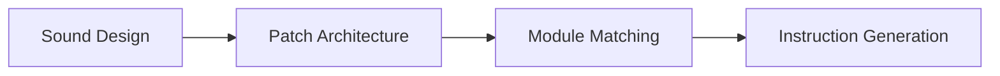

# Patch Advisor Implementation Summary

## Overview

The Patch Advisor is an intelligent modular synthesis assistant that transforms your manual Q&A system into a comprehensive patch design tool. It understands synthesis techniques, matches conceptual patches to your actual modules, and provides step-by-step patching instructions with visual diagrams.

## ✅ Completed Backend Implementation (Phases 1-3)

### Phase 1: Synthesis Knowledge Base

**Files Created:**
- `backend/app/services/synthesis_knowledge/sound_types.yaml`
- `backend/app/services/synthesis_knowledge/module_taxonomy.yaml`
- `backend/app/services/synthesis_knowledge/patch_templates.yaml`
- `backend/app/services/synthesis_knowledge/__init__.py`

**What it does:**
- Maps 10 sound types (drone, bass, lead, pad, percussion, etc.) to synthesis requirements
- Defines 16 module types (VCO, VCF, VCA, LFO, etc.) with detection patterns
- Provides 6 proven patch templates with signal flow diagrams
- Suggests module substitutions when equipment is missing

**Example Sound Types:**
- **Drone**: Sustained tones, requires VCO, VCF, LFO (slow), optional reverb
- **Bass**: Punchy low-frequency, requires VCO (sub-osc), VCF (lowpass), envelope (snappy)
- **FM Bell**: Metallic tones using frequency modulation

### Phase 2: Module Detection & Inventory

**Files Created:**
- `backend/app/services/pdf_processor/module_detector.py`
- `backend/app/services/vector_db/module_inventory.py`

**What it does:**
- Analyzes uploaded manual PDFs to detect module capabilities
- Uses pattern matching + confidence scoring (0-100%)
- Extracts technical specifications (waveforms, modulation inputs, etc.)
- Stores module inventory in separate ChromaDB collection

**Detection Example:**
When you upload a Moog Mother-32 manual, it detects:
- VCO (95% confidence): sawtooth, square, tracking, FM input
- VCF (90% confidence): lowpass, resonance, self-oscillation
- Envelope (85% confidence): AD stages, looping
- Sequencer (92% confidence): 32 steps, CV/gate outputs

### Phase 3: Multi-Agent Patch Design System (LangGraph)

**Files Created:**
- `backend/app/services/patch_advisor/state.py`
- `backend/app/services/patch_advisor/agents.py`
- `backend/app/services/patch_advisor/__init__.py`

**Agents:**

1. **Sound Design Agent**
   - Analyzes user's sonic goal ("I want a dark evolving drone")
   - Identifies sound type using Claude
   - Determines synthesis approach

2. **Patch Architecture Agent**
   - Retrieves synthesis requirements from knowledge base
   - Selects appropriate patch template
   - Generates conceptual signal flow

3. **Module Matching Agent**
   - Searches your module inventory (from uploaded manuals)
   - Matches required modules to your actual equipment
   - Identifies missing modules
   - Suggests alternatives when possible

4. **Instruction Generation Agent**
   - Creates Mermaid diagram with actual module names
   - Generates step-by-step patching instructions
   - Adds manual page references
   - Provides parameter suggestions

**Workflow:**


### Phase 4: API Layer

**Files Created:**
- `backend/app/api/routes/patch_advisor.py`
- Updated: `backend/app/api/models/schemas.py`
- Updated: `backend/app/core/dependencies.py`
- Updated: `backend/app/main.py`

**New API Endpoints:**

```
POST /api/patch/design
- Input: { "query": "I want to make a drone sound" }
- Output: Complete patch design with diagram, instructions, module list

GET /api/patch/module-inventory
- Lists all modules detected from uploaded manuals

GET /api/patch/module-inventory/{filename}
- Get capabilities for specific manual

GET /api/patch/capability-stats
- Statistics about detected modules

POST /api/patch/search-modules
- Search for modules by capability

GET /api/patch/workflow-graph
- Visualize the agent workflow
```

## Example Usage Flow

### 1. Upload Manuals (Existing + Enhanced)
```
User uploads: "Moog_Mother-32_Manual.pdf"
↓
System extracts manual chunks (existing functionality)
↓
NEW: System detects modules:
  - VCO (Analog oscillator with FM)
  - VCF (Ladder filter, resonance)
  - Envelope (AD with loop)
  - Sequencer (32 steps)
↓
Saved to both databases:
  - manual_chunks collection (for Q&A)
  - module_capabilities collection (for patch advisor)
```

### 2. Design a Patch
```
POST /api/patch/design
{
  "query": "I want to create a dark, evolving drone sound"
}

↓ Agent Workflow ↓

Sound Design Agent:
  - Identifies: "drone" sound type
  - Characteristics: sustained, evolving, dark
  - Approach: slow filter modulation

Patch Architecture Agent:
  - Selects template: "drone_machine"
  - Required modules: VCO, VCF, LFO (slow), reverb (optional)
  - Generates conceptual diagram

Module Matching Agent:
  - ✅ VCO: Found "Moog Mother-32" (manual p.12)
  - ✅ VCF: Found "Moog Mother-32" (manual p.18)
  - ✅ LFO: Found "Make Noise Maths" (manual p.8)
  - ⚠️ Reverb: Not found (suggest external pedal)
  - Match quality: 75%

Instruction Generation Agent:
  - Creates diagram with actual module names
  - Step 1: Patch Mother-32 VCO to VCF (p.12)
  - Step 2: Patch Maths LFO to VCF cutoff CV (p.8)
  - Step 3: Set LFO rate to 0.05 Hz (very slow)
  - Etc...
```

### 3. Response Example

```json
{
  "success": true,
  "sound_type": "drone",
  "characteristics": ["sustained", "evolving", "dark"],
  "match_quality": 0.75,
  "mermaid_diagram": "graph LR\n  VCO[VCO<br/>Moog Mother-32<br/>p.12] --> VCF[VCF<br/>Moog Mother-32<br/>p.18]\n  LFO[LFO<br/>Make Noise Maths<br/>p.8] -.->|Mod| VCF",
  "instructions": [
    {
      "step": 1,
      "action": "Generate fundamental tone",
      "module": "Moog Mother-32",
      "manual_reference": "Moog Mother-32 p.12",
      "settings": {}
    },
    ...
  ],
  "available_modules": [...],
  "missing_modules": [
    {
      "type": "reverb",
      "role": "Optional: high priority",
      "optional": true
    }
  ],
  "parameter_suggestions": {
    "lfo_rate": "0.01-0.1 Hz",
    "filter_resonance": "medium-high"
  }
}
```

## Database Collections

### 1. `manual_chunks` (Existing)
- Purpose: Q&A retrieval
- Content: Text chunks with page numbers
- Used by: Original Q&A system

### 2. `module_capabilities` (New)
- Purpose: Patch advisor module matching
- Content: Module capability descriptions
- Indexed by: Module type, features, manufacturer

## Technology Stack

- **LangGraph**: Multi-agent orchestration
- **ChromaDB**: Vector database (2 collections)
- **Claude (Anthropic)**: LLM for all agents
- **YAML**: Knowledge base storage
- **FastAPI**: REST API
- **Pydantic**: Request/response schemas

## Integration Points

### Automatic Module Detection
When users upload manuals through the existing UI, the system now:
1. Processes chunks for Q&A (existing)
2. **NEW**: Detects module capabilities automatically
3. **NEW**: Saves to module inventory for patch advisor

No changes required to existing upload flow!

### Backward Compatibility
- Existing Q&A functionality untouched
- New patch advisor is opt-in via new API endpoints
- Works alongside existing manual management

## What's Left: Frontend (Phase 4)

The backend is **100% complete**. Remaining work is frontend:

1. **New "Patch Advisor" Tab** (3-4 hours)
   - Sound description input
   - Mermaid diagram renderer (already supported by react-markdown!)
   - Module availability indicators
   - Instruction steps display

2. **API Integration** (1-2 hours)
   - Create React hooks for patch advisor API
   - Handle loading/error states

3. **Optional: User Preferences** (if desired)
   - Toggle for tracking synthesis style
   - Stored in SQLite

## Testing the Backend

You can test the backend right now using the FastAPI docs:

```bash
cd backend
poetry run python -m app.main
```

Then visit: http://localhost:8000/docs

Try the `/api/patch/design` endpoint with:
```json
{
  "query": "I want to make a dark drone"
}
```

## Files Changed/Created

### New Files (16):
- `backend/app/services/synthesis_knowledge/` (4 files)
- `backend/app/services/pdf_processor/module_detector.py`
- `backend/app/services/vector_db/module_inventory.py`
- `backend/app/services/patch_advisor/` (3 files)
- `backend/app/api/routes/patch_advisor.py`
- This document

### Modified Files (4):
- `pyproject.toml` (added langgraph, pyyaml)
- `backend/app/api/models/schemas.py` (added patch advisor schemas)
- `backend/app/core/dependencies.py` (added new singletons)
- `backend/app/main.py` (registered new routes)
- `backend/app/api/routes/manuals.py` (added module detection on upload)

## Architecture Diagram

```
┌─────────────────────────────────────────────────────────────┐
│                         FRONTEND                             │
│  ┌──────────┐  ┌──────────┐  ┌──────────────┐              │
│  │   Q&A    │  │ Manuals  │  │ Patch Advisor│  (NEW)       │
│  │   Tab    │  │   Tab    │  │     Tab      │              │
│  └──────────┘  └──────────┘  └──────────────┘              │
└───────────────┬─────────────────────┬───────────────────────┘
                │                     │
                ▼                     ▼
┌─────────────────────────────────────────────────────────────┐
│                      FASTAPI BACKEND                         │
│                                                               │
│  ┌─────────────────┐        ┌──────────────────────┐        │
│  │  Q&A Endpoints  │        │ Patch Advisor        │ (NEW)  │
│  │  /api/qa/*      │        │ /api/patch/*         │        │
│  └────────┬────────┘        └──────────┬───────────┘        │
│           │                             │                     │
│           ▼                             ▼                     │
│  ┌─────────────────┐        ┌──────────────────────┐        │
│  │   QA System     │        │  LangGraph Agents    │ (NEW)  │
│  │   (Claude)      │        │  • Sound Design      │        │
│  └────────┬────────┘        │  • Architecture      │        │
│           │                 │  • Module Matching   │        │
│           │                 │  • Instructions      │        │
│           │                 └──────────┬───────────┘        │
│           │                             │                     │
│           ▼                             ▼                     │
│  ┌──────────────────────────────────────────────────┐        │
│  │            ChromaDB (Vector Database)            │        │
│  │                                                   │        │
│  │  ┌────────────────┐    ┌────────────────────┐   │        │
│  │  │ manual_chunks  │    │ module_capabilities│   │ (NEW)  │
│  │  │ (Q&A search)   │    │  (patch matching)  │   │        │
│  │  └────────────────┘    └────────────────────┘   │        │
│  └──────────────────────────────────────────────────┘        │
│                                                               │
│  ┌──────────────────────────────────────────────────┐        │
│  │        Synthesis Knowledge Base (YAML)           │ (NEW)  │
│  │  • sound_types.yaml (10 types)                   │        │
│  │  • module_taxonomy.yaml (16 types)               │        │
│  │  • patch_templates.yaml (6 templates)            │        │
│  └──────────────────────────────────────────────────┘        │
└─────────────────────────────────────────────────────────────┘
```

## Next Steps

To complete the implementation, you need to:

1. **Create Frontend Hooks** (`frontend/src/hooks/usePatchAdvisor.ts`)
2. **Add Patch Advisor Tab** to `App.tsx`
3. **Mermaid Renderer** (already works via react-markdown!)
4. **Test with Real Manuals**

The backend is production-ready and waiting for the frontend!
